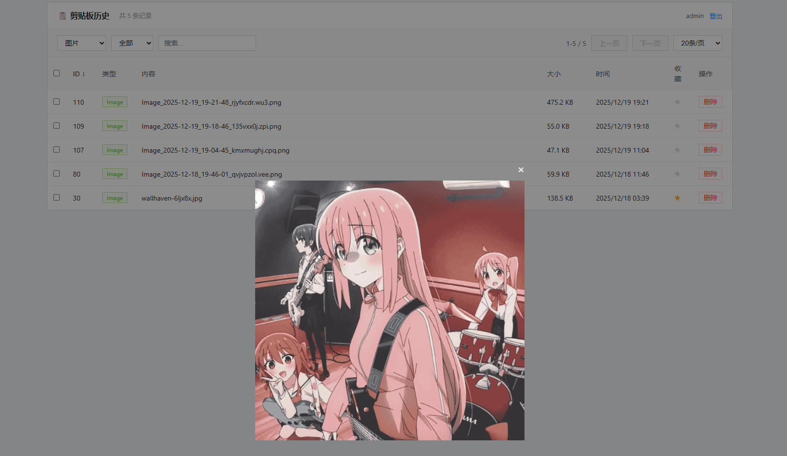
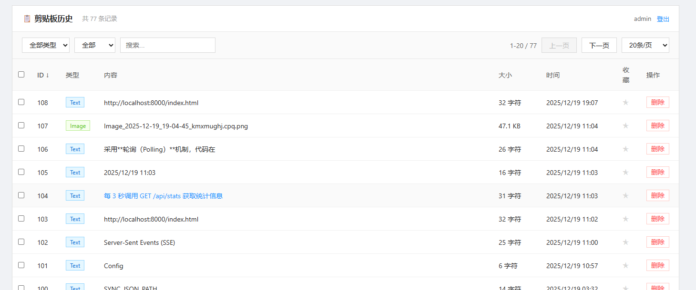

# ClipServer

SyncClipboard 服务端，以 WebDAV 为基础的历史查看界面。

## 功能

- WebDAV 服务端
- 查看 Clipboard 历史（搜索/筛选/分页/收藏/删除）
- 支持文本、图片、文件




## Docker 部署

镜像支持 `amd64` / `arm64`。

```yaml
services:
  clipserver:
    image: ting1e/clipserver:latest
    container_name: clipserver
    ports:
      - "8000:8000"
    volumes:
      - ./webdav_data:/app/webdav_data
    environment:
      - CLIP_USERNAME=admin
      - CLIP_PASSWORD=changeme
    restart: unless-stopped
```

```bash
docker-compose up -d
```

## 源码部署

```bash
pip install -r requirements.txt
cp .env.example .env  # 编辑配置
python main.py
```

## 使用

- SyncClipboard 服务器地址设置：`http://your-server:8000/dav`
- Web 历史记录地址：`http://your-server:8000`

- 建议自己反代https使用
> **web历史记录和SyncClipboard 服务器地址（webdav）使用相同的用户名密码，注意自己修改密码**

## 构建镜像

```bash
docker buildx create --name multibuilder --use
docker buildx build --platform linux/amd64,linux/arm64 -t ting1e/clipserver:latest --push .
```
